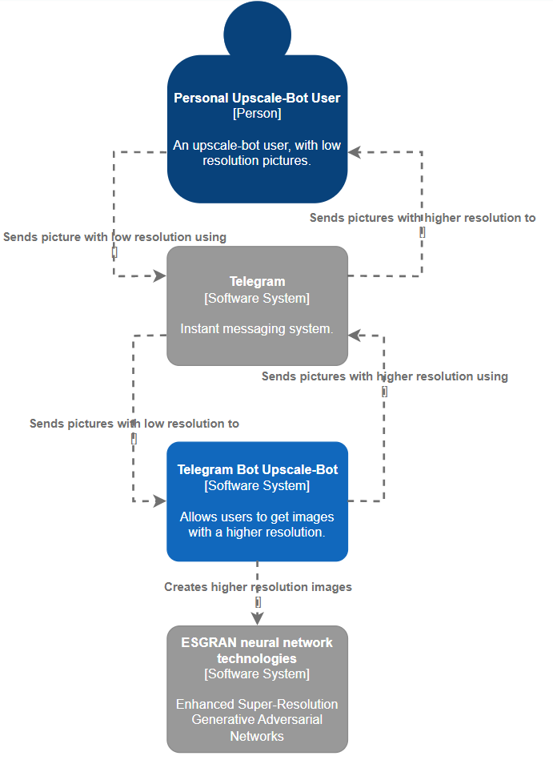

# UpscalePictureBot
This telegram bot allows you to improve the quality of low-resolution images using ESGRAN neural network technologies.

## Contributors
[Anton Lutsenko](https://github.com/vihmavari), group 3530904/00102

## Problem
People often face the fact that the picture quality leaves much to be desired. This bot uses modern technologies (neural networks) that allow you to improve the image quality and achieve an eye-pleasing result.

## Requirements

# C4 Diagrams
## Level 1: System Context diagram

## Level 2:Container diagram

